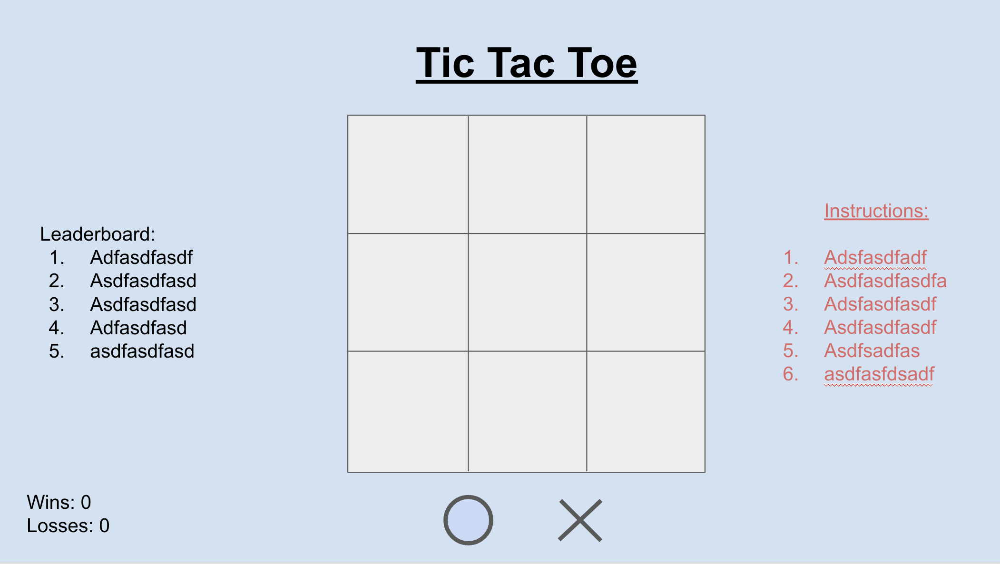

# Tic Tac Toe

## Decsription
A browser-based Tic Tac Toe game coded in JavaScript, HTML and CSS.

## Planning Process

### User Stories

#### MVP

- As a user, I want an browser-based interface so that I can play the game.
- As a user, I want to place my token so that I can interact with the game. 
- As a user, I want the game to reach a win state so that I know who won and can play again. 
- As a user, I want to have two different tokens so that I can know who marked in which spot
- As a user, I want to play against a computer
- As a user, I want my moves to stay visible on the game board so I can streategize.
- As a user, I want a gameboard so that I can see which spaces are taken with a specific player's token. 
- As a user, I want to be able to restart the game

#### Bronze

#### Silver

#### Gold

- As a user, I want to be able to upload my own image as my token so that I can customize the game. 

### Wireframes

<!-- Useful info -->
<!-- This is a link to [Google](https://google.com). -->
<!-- 

 -->